# Virtual lab environment

## Prerequisites

### Ubuntu ISO

Download Ubuntu Desktop ISO from https://ubuntu.com/download/desktop.

### VirtualBox

#### macOS

Install [Homebrew](https://brew.sh) if it's not already available.

```bash
/bin/bash -c "$(curl -fsSL https://raw.githubusercontent.com/Homebrew/install/master/install.sh)"
```

Install VirtualBox via Homebrew

```bash
brew cask install virtualbox
```

## Setting up the virtual machine

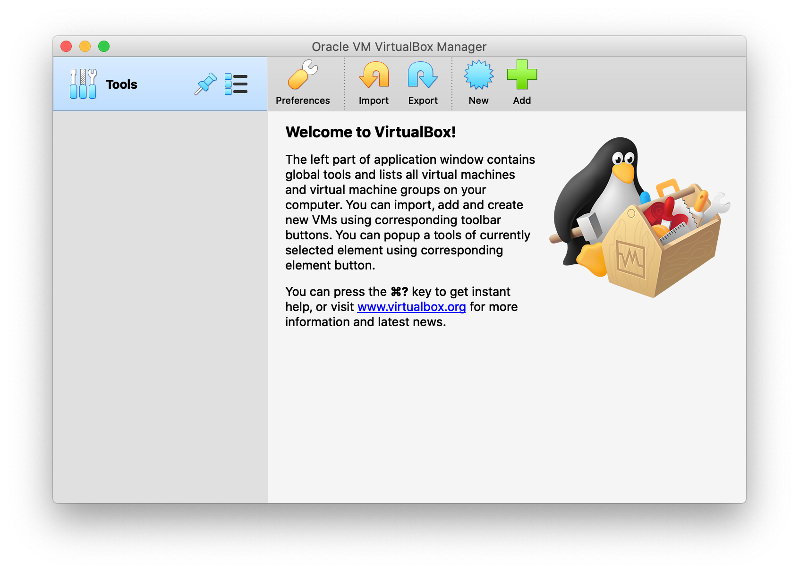

Open up VirtualBox and click on the button labeled `New`.


Give the machine a name and select `Linux` and `Ubuntu (64-bit)` for type and version. The machine folder can be left default.


Give the machine a reasonable amount of memory, such as 4GB on a machine with 16GB in total.

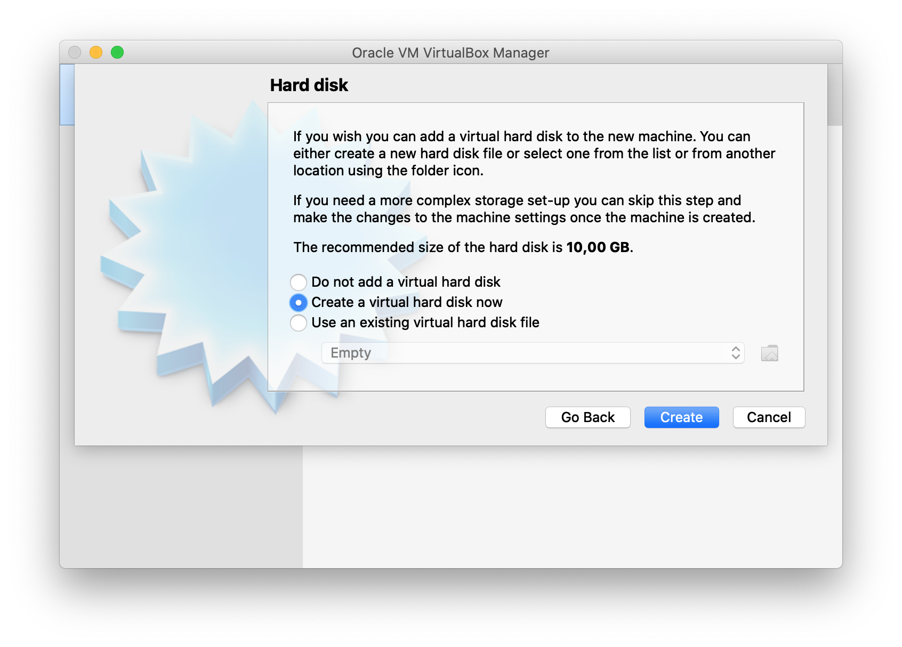

Click through the next few steps to create a virtual hard drive. Leave the defaults.

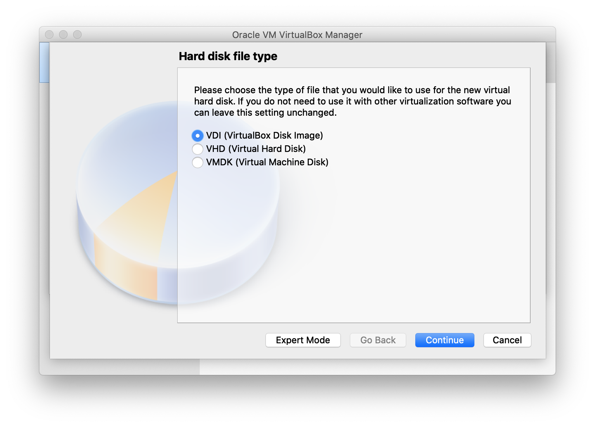


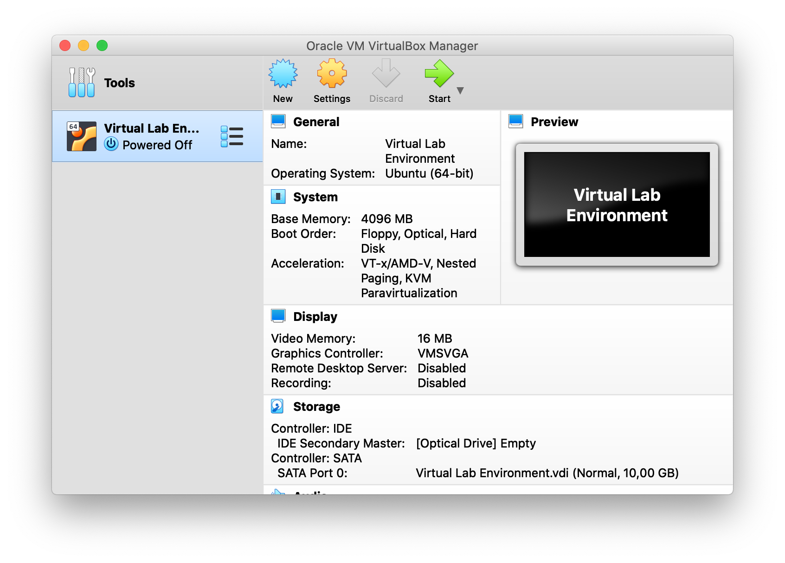

Click on the newly created virtual machine in the left pane and then on the cog labeled `Settings`.


Navigate to the storage section and click on the `Empty` slot under `Controller: IDE`. Click on the disk icon next to the `IDE Secondary Master` dropdown. Find and select the previously downloaded Ubuntu ISO.


Click on the button labeled `OK` in order to close the window.


Start the machine by clicking on the green arrow labeled `start`. If prompted, select the previously selected Ubuntu ISO and click `Start`.

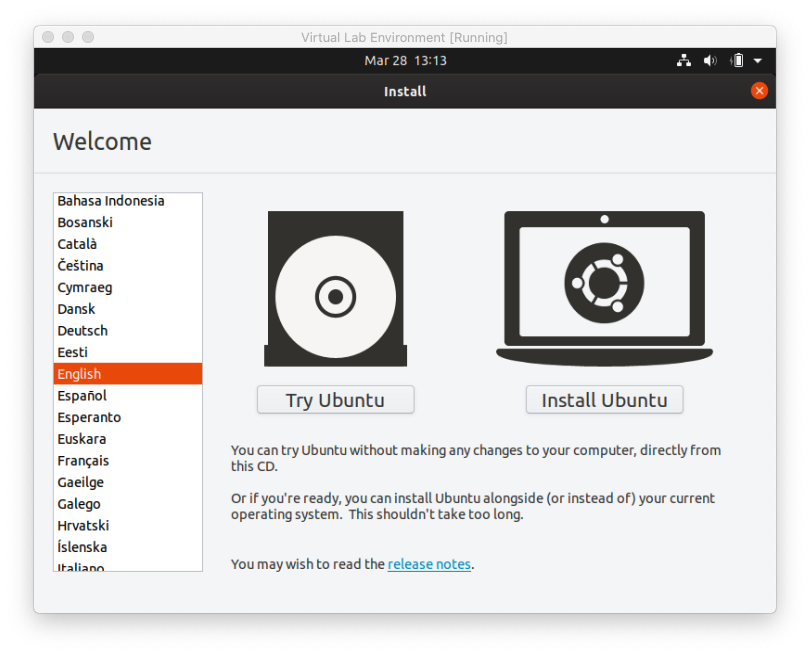

Click on the button labeled `Install Ubuntu`.

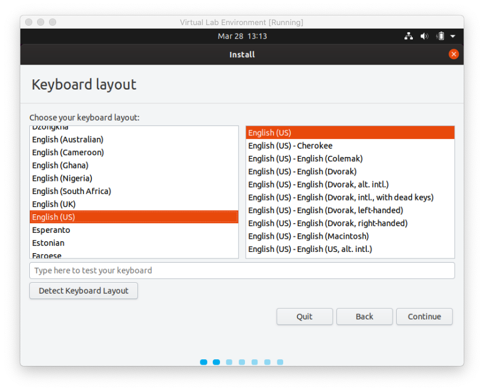

Use the `Detect Keyboard Layout` mode and follow the on-screen directions in order to setup the proper layout.


Select `Minimal installation` and click the button labeled `Continue`.

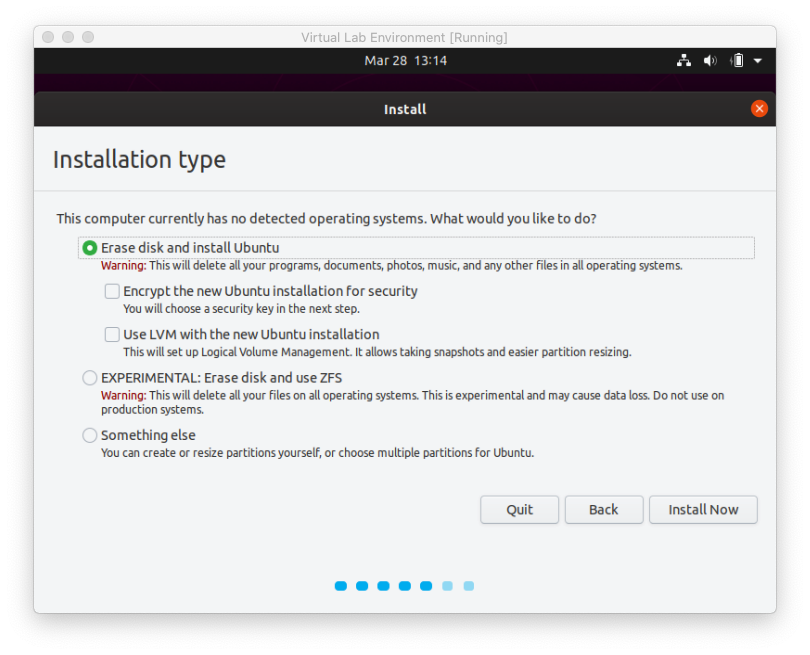

Select `Erase disk and install Ubuntu` and click `Install Now`.


Click `Continue`

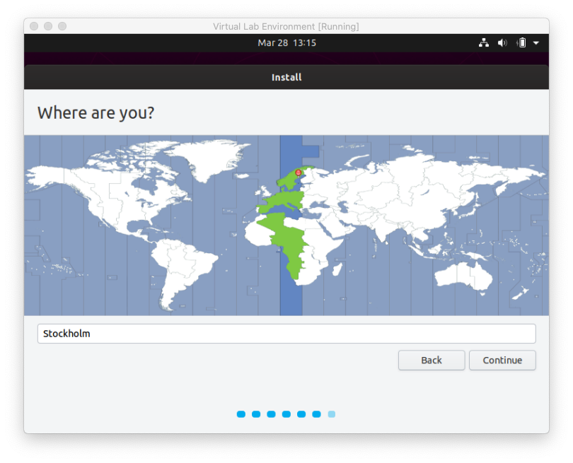

Select your timezone.


Enter the default user's credentials. In this case the username is `pa1450` and the password is `pa1450`. Select `Log in automatically`. The next step will take a few minutes to complete.

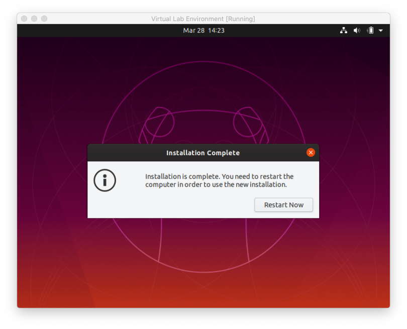

Click on the button labeled `Restart Now`. When asked to remove the install medium, press the enter key.

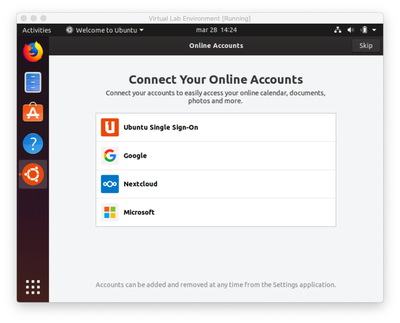

Skip the social login.


Choose the option to not send any information to Canonical. Click on the `Next` button.


Do not enable the location service. Click on the `Next` button.

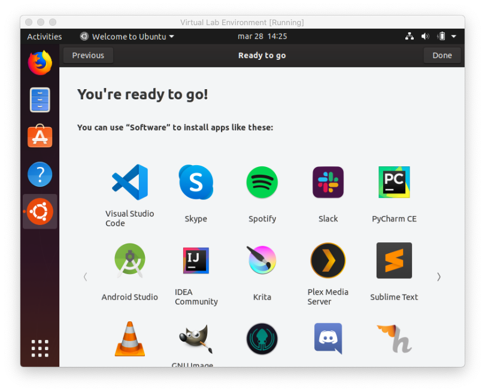

Press the button labeled `Done`.

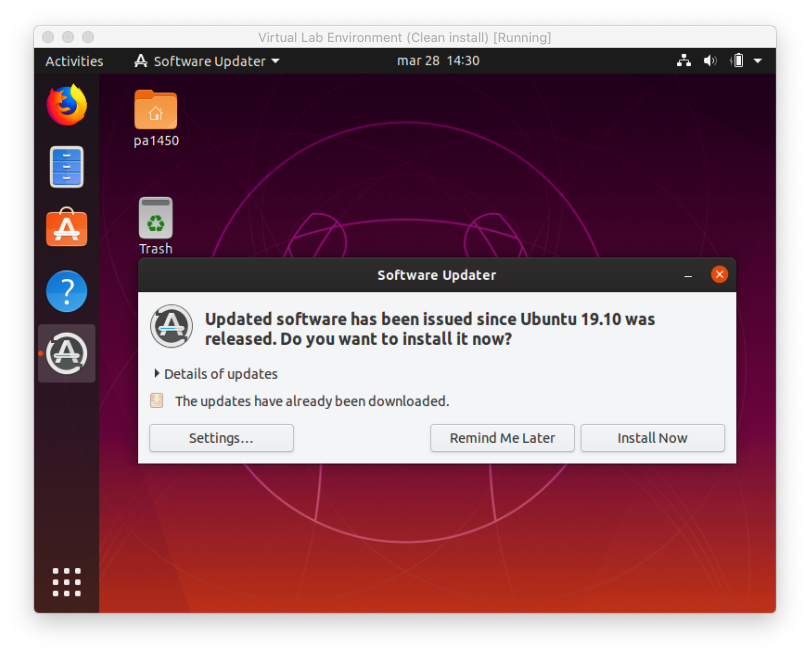

If a popup has appeared asking you to update, press `Install Now`.


Wait for the update to finish and click on the button labeled `Restart Now`.

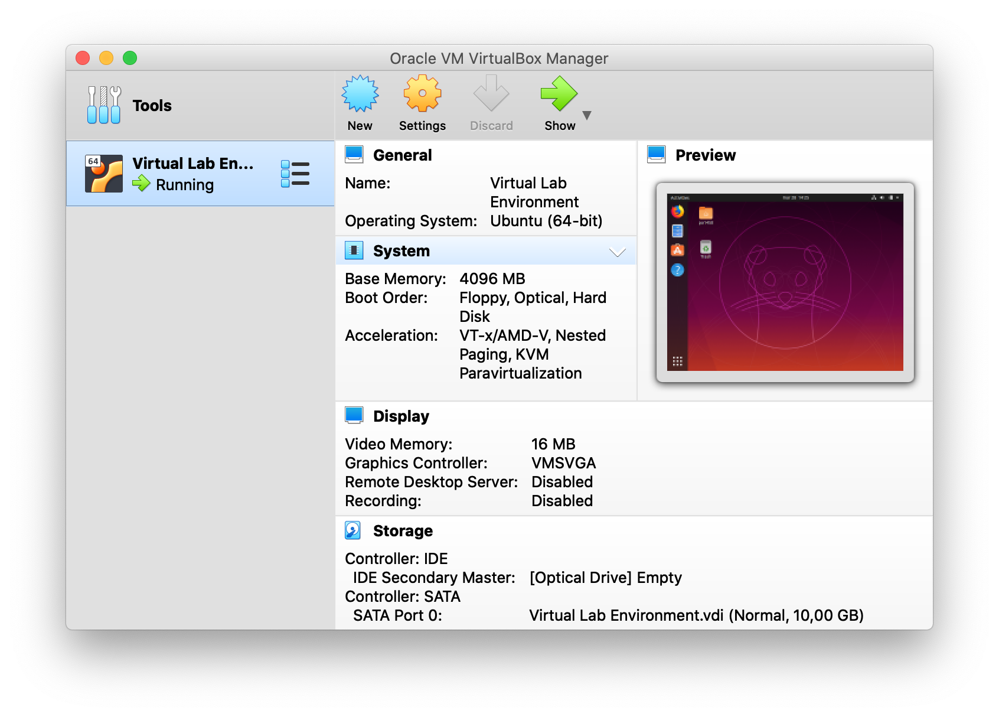

Go back to the main VirtualBox window and click on the list right to the virtual machine's name. Click on the item labeled `Snapshots`.

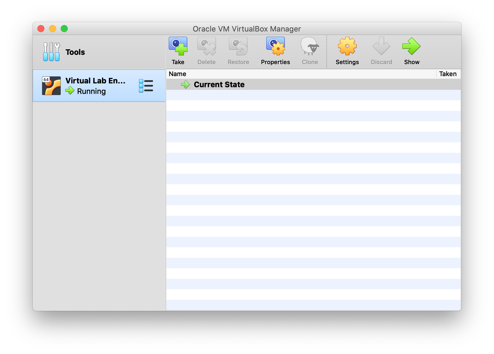

Click on the button labeled `Take`.

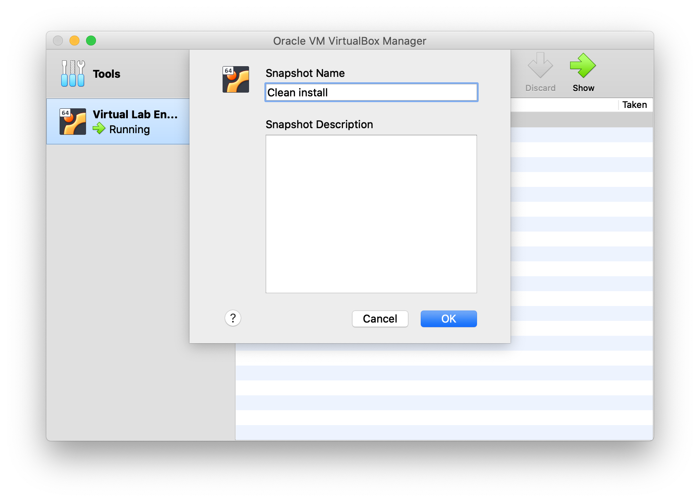

Name the snapshot to `Clean install`. Click the button labeled `OK`. The snapshot allows us to go back to the clean state if we need to later.

## Installing development environment

To install the development environment, execute the script called `setup.sh`.


This is done by first getting the script onto the virtual machine. This is most easily done by first navigating to the script on GitHub, and then pressing the `Raw` button. The URL can then be shortened using a URL shortener and used in the following command on the virtual machine:

```bash
wget https://url-to-setup.sh -O setup.sh
```

_Note: replace `https://url-to-setup.sh` with the actual URL to the script._

You can now run the script by typing

```bash
sudo bash setup.sh
```

Follow the on-screen instructions carefully. Once the script has completed the machine will restart.


Once it has started again, enable clipboard sharing by navigating to the virtual machine's settings and selecting `Bidirectional` for `Shared Clipboard` and `Host To Guest` for `Drag'n'Drop`.

Lastly, create a second snapshot using the same steps as previously. This time call it `Configured`.
